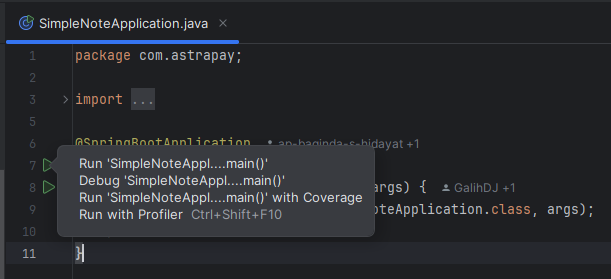
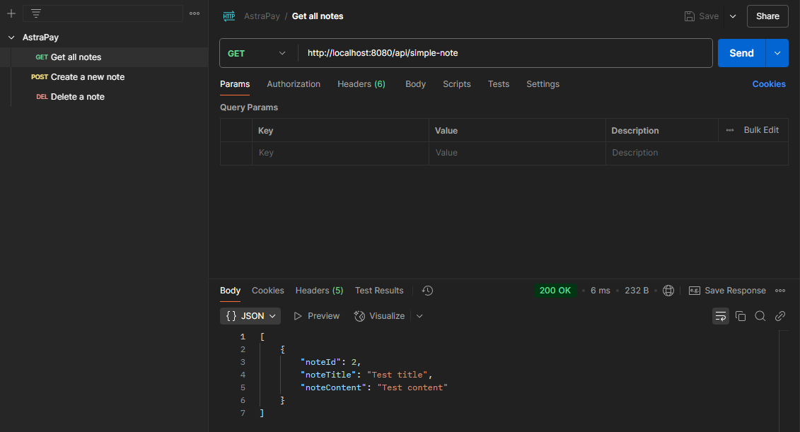
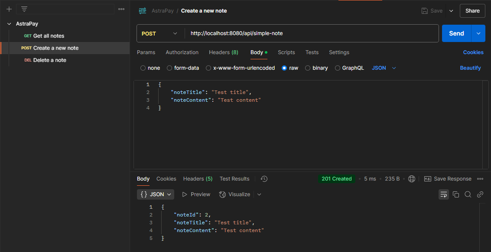
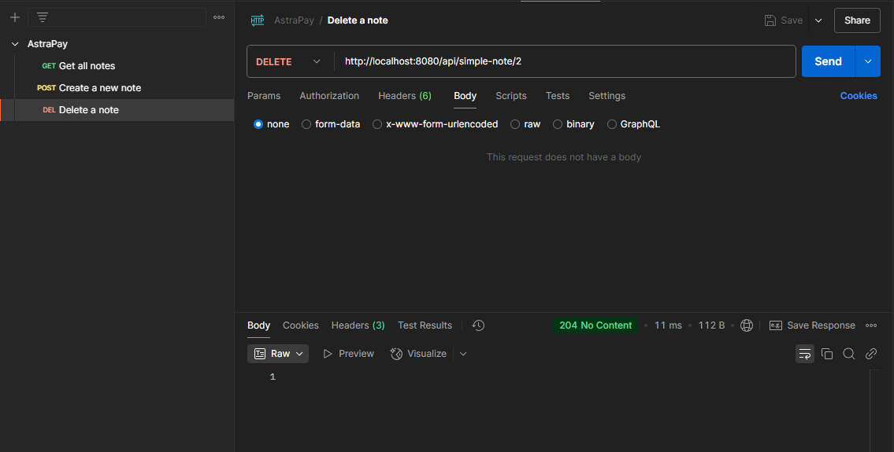
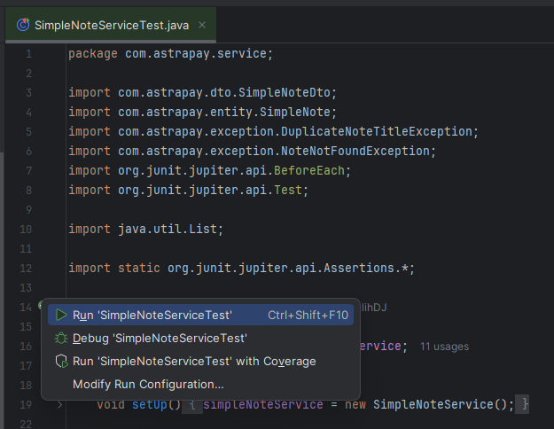

# Spring Boot Astrapay - Simple Notes Project
A simple RESTful API project to create, read, and delete note written in Java Spring Boot.

#### Author Information:  
- Galih Damar Jati

## Prerequisites
- Java 17+
- Maven 3.8+
- Postman (for API testing) https://www.postman.com/downloads/
- Intellij https://www.jetbrains.com/idea/download/

## Getting Started (How to Run the Program)

These instructions will get you a copy of the project up and running on your local machine for development and testing purposes.


* Clone the repository and navigate to the project directory.
```bash
   git clone https://github.com/your-username/astrapay-spring-boot-external.git
```


* To build and run enter the command below:
```bash
   mvn spring-boot:run
```

* Alternate way is to naviage to SimpleNoteApplication.java and click the green arrow or by pressing Ctrl+Shift+F10 on Windows



* API will be available at the URL below
```bash
   http://localhost:8080/api/simple-note
```

## Testing API with Postman

* To test the APIs with Postman you need to import the Postman collection provided to your Postman
  https://learning.postman.com/docs/getting-started/importing-and-exporting/importing-data/


* GET



* POST



* DELETE



* Input validation result for title longer than 100 characters


* Input validation result for content longer than 1000 characters


* Input validation for blank title


* Input validation for blank content


## Run Unit Test

* To run unit test enter the command below:
```bash
   mvn test
``` 

* Alternate way is to navigate to test java file and click the green arrow or by pressing Ctrl+Shift+F10 on Windows
